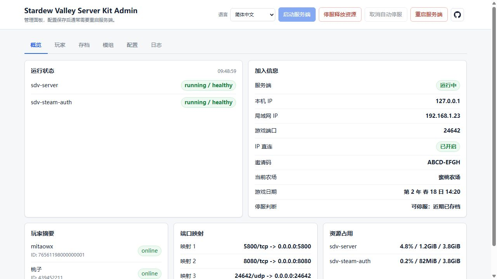
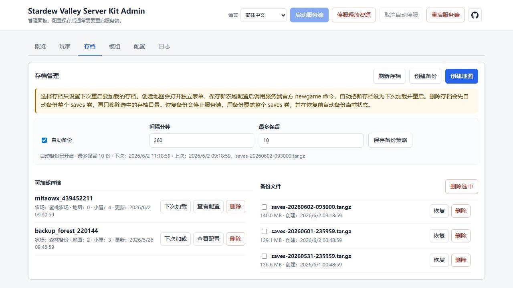
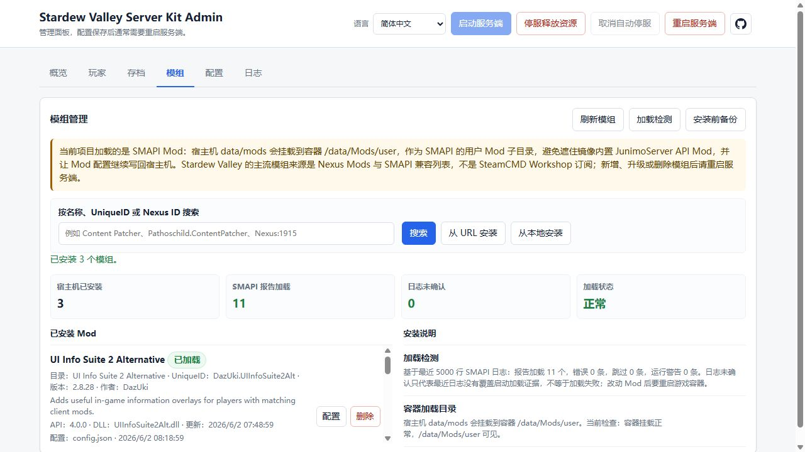
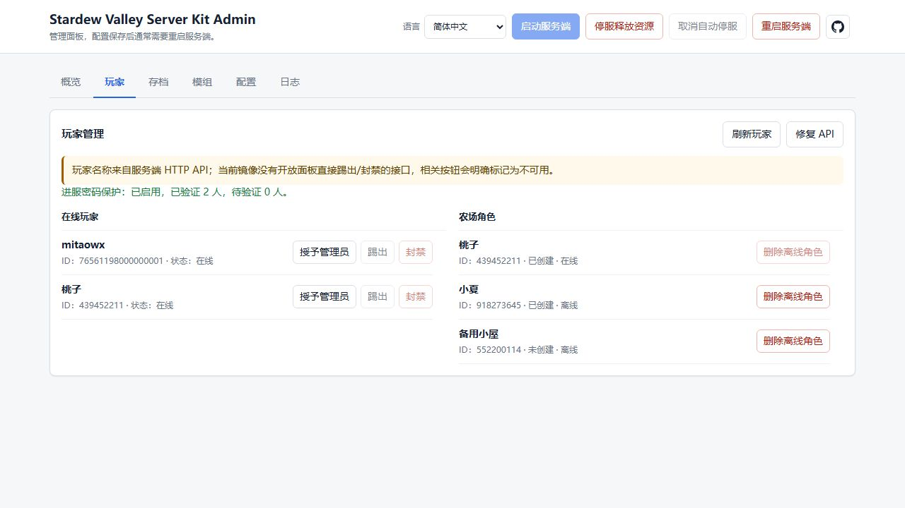

# Stardew Valley Headless Server Kit

> 星露谷物语无头服务器一键搭建包：基于 Docker、JunimoServer 和 SMAPI Mods，让农场可以长期在线。

[](LICENSE)
[](https://www.docker.com/)

## 新手先看

如果你只是想把星露谷物语服务器部署到一台云服务器上，不要从源码构建开始看。

推荐阅读顺序：

1. [新手使用指南](docs/BEGINNER_GUIDE.md)
2. [故障排查](docs/TROUBLESHOOTING.md)
3. [日常维护](docs/OPERATIONS.md)

普通服主只需要记住一个入口：

```bash
./setup.sh
```

运行后会出现菜单。按菜单一步一步做即可：

1. 填写 Steam 账号密码。
2. 执行一键部署。
3. 按提示完成 Steam Guard。
4. 打开 Web 管理面板。
5. 创建自己的正式农场。
6. 删除默认 / 测试存档。
7. 复制加入信息给玩家。

Windows 本地测试入口是：

```powershell
.\setup.ps1
```

Linux 服务器入口是：

```bash
chmod +x ./setup.sh
./setup.sh
```

## 项目地址

- GitHub：`https://github.com/wuxianggujun/StardewValleyServerKit`
- Gitee 国内镜像：`https://gitee.com/wuxianggujun/StardewValleyServerKit`

国内服务器如果访问 GitHub 不稳定，可以优先从 Gitee 拉取项目：

```bash
git clone https://gitee.com/wuxianggujun/StardewValleyServerKit.git
```

## 适合谁

适合：

- 想开一个长期在线星露谷物语农场的服主。
- 不想手写 Docker Compose 和 SteamCMD 命令的新手。
- 想通过网页管理存档、玩家、Mod 和备份的人。
- 在国内云服务器上部署，担心 Docker Hub / GitHub 访问不稳定的人。

不适合：

- 想绕过正版校验的人。
- 不想使用 Docker 的原生部署用户。
- 想把 Stardew Valley 游戏文件随项目一起分发的人。

本项目不分发 Stardew Valley 游戏文件，也不绕过正版校验。部署时需要一个拥有 Stardew Valley 的 Steam 账号。

## 界面预览

<table>
  <tr>
    <td width="50%">
      
    </td>
    <td width="50%">
      
    </td>
  </tr>
  <tr>
    <td width="50%">
      
    </td>
    <td width="50%">
      
    </td>
  </tr>
</table>

## 新手部署流程

完整步骤见 [新手使用指南](docs/BEGINNER_GUIDE.md)。这里是最短版本。

### 1. 准备服务器

推荐使用 Linux 云服务器。新服务器需要先安装 Docker Engine 和 Docker Compose v2：

```bash
curl -fsSL https://get.docker.com | sh
sudo usermod -aG docker $USER
newgrp docker
```

国内服务器如果下载 Docker 镜像失败，脚本会在失败后询问是否临时配置 Docker Hub 镜像源并重启 Docker。只有输入 `yes` 才会执行。

### 2. 获取项目

```bash
git clone https://gitee.com/wuxianggujun/StardewValleyServerKit.git
cd StardewValleyServerKit
chmod +x ./setup.sh
```

如果你拿到的是发布包，解压后进入目录即可，不需要 `git clone`。

### 3. 运行菜单

```bash
./setup.sh
```

菜单里按顺序执行：

1. `Fill or update Steam username/password`
2. `One-click setup / deploy / repair`
3. `Run Steam login / Guard verification`
4. `Web admin wizard / proxy / token`

Steam 密码和验证码只输入到自己的终端里，不要发到聊天、Issue 或截图里。

### 4. 打开网页管理面板

新买的裸服务器没有 Nginx / 1Panel 时，推荐在菜单里选择裸服务器公网直连模式。它会使用：

```bash
sudo ./scripts/sdv-server.sh admin-service-install-public
```

然后在云厂商安全组和服务器防火墙放行：

```text
8088/tcp
```

浏览器访问：

```text
http://<服务器公网IP>:8088
```

网页登录令牌来自 `.env` 的 `ADMIN_TOKEN`。不想手动打开 `.env` 时执行：

```bash
./setup.sh admin-token-show
```

按提示输入 `SHOW` 后，脚本只打印一次网页登录令牌。

注意：`8080` 是服务端 HTTP API，不是网页登录页。浏览器直接访问 `8080` 看到 `Unauthorized` 是正常现象。

### 5. 创建自己的农场

部署完成后，默认 / 测试存档只是一个普通存档。不要 SSH 进 Docker volume 手动删除。

在 Web 管理面板里：

1. 进入“存档管理”。
2. 点击“创建地图”。
3. 填写农场名、地图类型、小屋数量、人数和利润比例。
4. 确认创建自己的正式农场。
5. 如果要删除默认 / 测试存档，先确认没有玩家在线，再点击该存档的“删除”。
6. 删除时输入完整存档名确认。

删除前面板会自动备份整个 saves volume，然后只删除被选中的存档目录。

## 常用入口

新手日常只需要这些命令：

```bash
./setup.sh
./setup.sh status
./setup.sh logs
./setup.sh restart
./setup.sh backup
./setup.sh admin-token-show
```

Windows 本地测试对应：

```powershell
.\setup.ps1
.\setup.ps1 status
.\setup.ps1 logs
.\setup.ps1 restart
.\setup.ps1 backup
.\setup.ps1 admin-token-show
```

更完整的运维说明见 [日常维护](docs/OPERATIONS.md)。

## 功能概览

- 一键部署：生成 `.env`、拉取镜像、Steam 登录、下载游戏文件、启动服务端。
- Web 管理面板：查看状态、加入信息、玩家、存档、Mod、配置和日志。
- Steam 双链路：优先 `steam-auth`，失败时可回退 SteamCMD。
- 国内网络兜底：Docker Hub 拉取失败后可交互配置临时镜像源。
- 存档管理：创建地图、切换存档、删除存档、备份和恢复。
- Mod 管理：扫描已安装 Mod，从 URL / Nexus 安装，编辑配置并重启服务端。
- 安全停服：在线玩家存在时提示保存状态，必要时等待下一次保存后停服。
- 中英文面板：Web 管理面板支持简体中文 / English 切换。

## 文档导航

面向普通用户：

- [新手使用指南](docs/BEGINNER_GUIDE.md)
- [日常维护](docs/OPERATIONS.md)
- [故障排查](docs/TROUBLESHOOTING.md)
- [Steam 下载备用流程](docs/STEAM_DOWNLOAD_FALLBACK.md)

面向测试和长期维护：

- [测试计划](docs/TEST_PLAN.md)
- [自动化测试](docs/AUTOMATED_TESTING.md)
- [阿里云部署记录](docs/ALIYUN_DEPLOYMENT_RECORD.md)

面向开发者 / 高级用户：

- [开发者指南](docs/DEVELOPER_GUIDE.md)

## 安全提醒

不要公开这些内容：

- `.env`
- Steam 密码
- Steam Guard 验证码
- `ADMIN_TOKEN`
- `API_KEY`
- `VNC_PASSWORD`
- 任何包含账号密码的代理地址

脚本的普通状态输出只显示 `set` / `missing`，不会打印密码或令牌。`admin-token-show` 必须手动输入 `SHOW` 才会打印 Web 管理面板令牌。

## 支持项目

如果这个工具帮你省了时间，可以扫下面的二维码支持一下。

| 微信赞赏码 | 支付宝收款码 |
| :---: | :---: |
|  |  |

## 上游项目

- [JunimoServer](https://github.com/stardew-valley-dedicated-server/server)
- [JunimoServer 文档](https://stardew-valley-dedicated-server.github.io/server/)
- [SMAPI](https://smapi.io/)
- [linuxserver/docker-baseimage-kasmvnc](https://github.com/linuxserver/docker-baseimage-kasmvnc)

## 开源协议

本项目代码以 [MIT License](LICENSE) 开源。

Stardew Valley、SMAPI、JunimoServer、Steam、Docker、Discord、Nexus Mods 等名称和资源分别归其权利人所有。
